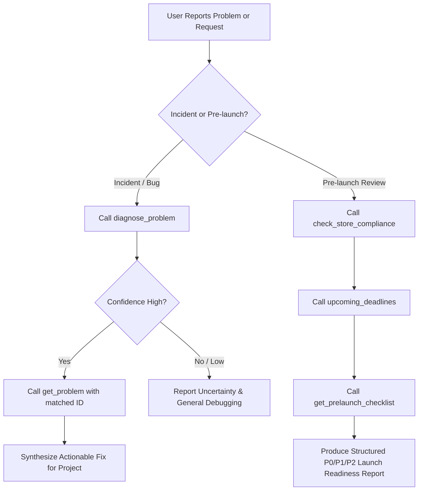

# Mobile Game Triage Skill

This skill enables AI agents to troubleshoot mobile game issues, evaluate store compliance deadlines, and audit source projects deterministically.

## When to Use

Activate this skill when:
- Investigating mobile game performance degradation (thermal throttling, GC spikes, shader warmup stutter, draw calls).
- Diagnosing OOM crashes on low-RAM devices or Android Vitals ANR / crash rate threshold warnings.
- Resolving store upload rejections (Target SDK, 16 KB ELF alignment, Apple Privacy Manifest, ATT IDFA, Loot box odds disclosure).
- Investigating IAP missing items, savegame migration failures, or Live-Ops kill switch configurations.
- Auditing local game project directories before submitting to Google Play or Apple App Store.

## Step-by-Step Triage Workflow

### 1. Diagnosing an Incident
1. Invoke MCP tool `diagnose_problem` with the user's natural language symptom, platform, and game engine.
2. If confident matches exist, fetch the canonical knowledge record via `get_problem(id)`.
3. Tailor the concrete steps to the developer's project context.
4. **Safety Rule:** If match confidence is `low` or no match is found, clearly state that no direct policy/practice match exists; never hallucinate a store rule or arbitrary API workaround.

### 2. Pre-launch Store Readiness Audit
1. Call `check_store_compliance` with `projectPath` and `platform` (`android`, `ios`, `both`).
2. Call `upcoming_deadlines` to identify impending policy deadlines (e.g., API 35+, 16 KB ELF alignment).
3. Call `get_prelaunch_checklist` tailored to the monetization model (IAP, Ads, Gacha) and child policy.
4. Categorize findings into:
   - **P0 (Blockers):** Store upload errors, invalid ELF 16KB alignments, missing Privacy Manifest reasons.
   - **P1 (Impending Deadlines):** Policies with deadlines $\le 30$ days.
   - **P2 (Quality & Live-Ops):** Save schema migration checks, remote kill switches, rate limiting.
