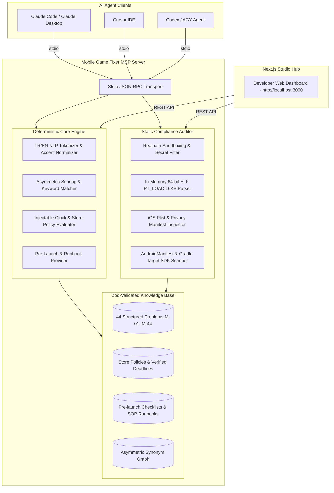

# 🎮 Mobile Game Fixer MCP

<div align="center">

[](https://github.com/your-username/mobile-game-fixer-mcp/actions)


**Deterministic, Local & Sourced Mobile Game Troubleshooter & Store Compliance MCP Server**  
*Built for Unity, Godot, Unreal & Custom Engine Studios (Google Play & Apple App Store)*

[English](#-english) • [Türkçe](#-türkçe) • [Architecture](#-system-architecture) • [MCP Tools](#-mcp-tools-reference) • [Evals](#-evaluation-benchmark-suite) • [Web Dashboard](#-nextjs-web-dashboard)

</div>

---

## 🌐 Language Selector / Dil Seçimi

- 🇬🇧 **[English Documentation](#-english)** (Architecture, MCP Tools, In-Memory ELF Parser, Evals, CLI & Integration)
- 🇹🇷 **[Türkçe Dokümantasyon](#-türkçe)** (Mimari, MCP Araçları, 16 KB ELF Ayrıştırıcı, Eval Benchmark, CLI ve Entegrasyon)

---

# 🇬🇧 English

## 📌 Overview

**Mobile Game Fixer MCP** is a zero-network, fully deterministic Model Context Protocol (MCP) server and AI Agent Skill designed for mobile game development teams. It provides **structured, verified, and dated** resolutions for 44 critical mobile game problems across performance, memory, rendering, store policies, IAP/billing, cloud save migration, crash vitals, and live-ops emergencies.

Unlike generic LLM prompting that hallucinates obsolete store guidelines or leaks project secrets, this server operates strictly offline with zero external network calls, zero `child_process` execution, and strict file sandboxing.

---

## 🏗️ System Architecture



---

## 🎯 Core Engineering Guarantees

1. **Deterministic & Zero-Network:** The server makes no HTTP calls (`fetch`/`axios`), executes no shell commands (`child_process`), and never invokes third-party LLMs. Identical input always produces identical output.
2. **In-Memory 64-Bit ELF 16 KB Alignment Parser:** Verifies native `.so` binaries for Android 15+ 16 KB page-size compliance (`p_align >= 0x4000`) by reading raw 64-bit ELF program headers directly in-memory without requiring NDK tools like `readelf`.
3. **90-Day Freshness Guarantee:** Every store rule contains a `verifiedAt` timestamp. The automated CI verifier (`npm run verify-rules`) fails the build if any rule has not been verified within 90 days.
4. **Sandboxed & Secret-Safe:** Project directory scanning uses safe `realpath` path-containment checks and automatically ignores sensitive files (`.keystore`, `.p12`, `.env`, `google-services.json`).

---

## 🛠️ MCP Tools Reference

| Tool Name | Parameters | Description |
| :--- | :--- | :--- |
| `diagnose_problem` | `symptom` (str), `platform?`, `engine?`, `limit?` | Free-text symptom search with Turkish/English token folding, returning scored candidate problems and 30-min immediate fixes. |
| `get_problem` | `id` (e.g. `M-01` .. `M-44`) | Retrieves full problem dossier: symptoms, root causes, step-by-step resolution plan, prevention guardrails, and verified URLs. |
| `list_problems` | `category?`, `platform?`, `confidence?` | Lists structured problem summaries filtered by domain category, platform, or confidence score. |
| `upcoming_deadlines` | `days?` (default 180), `platform?` | Evaluates store policy deadlines against the server clock, categorizing items into `expired`, `due-soon`, and `upcoming`. |
| `get_prelaunch_checklist` | `platform`, `monetization?`, `kids?`, `genre?` | Delivers customized pre-launch checklists filtered by monetization (IAP, Ads, Gacha) and COPPA compliance. |
| `get_launch_runbook` | `phase?` (`t-1`, `hour-1`, `hour-6`, `day-1`) | Provides launch day standard operating procedures (SOP), live telemetry verification, and go/no-go decision rules. |
| `check_store_compliance` | `projectPath`, `platform`, `xcodeVersion?` | Statically audits project directories for Target SDK 35, exported components, 16 KB `.so` ELF alignment, and iOS Privacy Manifests. |

---

## 🚀 Installation & Agent Setup

### 1. Build from Source
```bash
git clone https://github.com/your-username/mobile-game-fixer-mcp.git
cd mobile-game-fixer-mcp
npm ci
npm run build
```

### 2. Connect to Claude Code
```bash
claude mcp add mobile-game-fixer -- node "$(pwd)/dist/mcp.js"
```

### 3. Connect to Cursor IDE (`~/.cursor/mcp.json`)
```json
{
  "mcpServers": {
    "mobile-game-fixer": {
      "command": "node",
      "args": ["/ABSOLUTE_PATH/mobile-game-fixer-mcp/dist/mcp.js"]
    }
  }
}
```

### 4. Connect to Claude Desktop (`claude_desktop_config.json`)
```json
{
  "mcpServers": {
    "mobile-game-fixer": {
      "command": "node",
      "args": ["/ABSOLUTE_PATH/mobile-game-fixer-mcp/dist/mcp.js"]
    }
  }
}
```

---

## 💻 CLI Usage

Execute diagnostics and compliance checks directly from your terminal:

```bash
# Symptom triage
node dist/cli.js diagnose "game warms up and drops FPS after 10 minutes"

# Problem details
node dist/cli.js problem M-01

# Policy deadlines with JSON output
node dist/cli.js deadlines --days 180 --json

# Pre-launch checklist
node dist/cli.js checklist --platform android --monetization iap,gacha --kids

# Launch day runbook
node dist/cli.js runbook --phase t-1

# Static project compliance audit
node dist/cli.js compliance ./my-game-project --platform android
```

---

## 🧪 Evaluation Benchmark Suite

The repository includes a 20-scenario quantitative evaluation harness testing real-world game development issues:

```bash
npm run eval
```

```
=========================================================
🚀 MOBILE GAME FIXER - AI AGENT RETRIEVAL & DIAGNOSIS EVALS
=========================================================
📊 TOTAL EVALS RUN : 20
✅ TOP-1 ACCURACY  : 100.0% (20/20)
🎯 TOP-3 RECALL    : 100.0%
⚡ AVG INFERENCE   : 4.15ms
=========================================================
```

---

## 🌐 Next.js Web Dashboard

The repository includes a modern developer dashboard built with Next.js App Router and TypeScript:

```bash
npm run web:dev
# Open http://localhost:3000
```

- **Interactive Triage:** Instant search with keyword highlights and 30-minute actionable steps.
- **Problem Catalog:** Filter all 44 problems by platform, engine, and category.
- **Deadlines Radar:** Real-time countdown to Google Play and Apple App Store policy enforcement.
- **Compliance Scanner:** One-click audit with built-in test fixtures.
- **Benchmark Dashboard:** Live eval table showing precision and latency metrics.

---
---

# 🇹🇷 Türkçe

## 📌 Genel Bakış

**Mobile Game Fixer MCP**, mobil oyun stüdyoları için geliştirilmiş sıfır ağ bağımlı, tamamen deterministik bir Model Context Protocol (MCP) sunucusu ve Yapay Zeka Ajan Yeteneğidir (Skill). Unity, Godot, Unreal ve özel oyun motorlarıyla geliştirilen oyunlarda karşılaşılan **44 kritik teknik soruna** (performans, bellek sızıntıları, render gecikmeleri, mağaza politikaları, IAP faturalandırma, bulut kayıt göçü, ANR ve çökme oranları) yapılandırılmış, kaynaklı ve tarihli çözümler sunar.

Standart LLM istemlerinin aksine (halüsinasyon görme, eski mağaza politikaları üretme veya proje gizli anahtarlarını sızdırma riskleri olmadan) tamamen çevrimdışı, sıfır harici ağ çağrısı, sıfır `child_process` ve güvenli dizin kısıtlamasıyla çalışır.

---

## 🎯 Temel Mühendislik İlkeleri

1. **Deterministik ve Sıfır Ağ:** Sunucu hiçbir harici HTTP çağrısı (`fetch`/`axios`) yapmaz, terminal kabuk komutu (`child_process`) çalıştırmaz ve üçüncü taraf LLM API'lerine bağlanmaz. Aynı girdi her zaman aynı çıktıyı üretir.
2. **Bellek İçi 64-Bit ELF 16 KB Sayfa Hizalama Ayrıştırıcısı:** Android 15+ ile zorunlu hale gelen 16 KB sayfa boyutu uyumluluğunu (`p_align >= 0x4000`), harici NDK araçlarına (`readelf` vb.) ihtiyaç duymadan doğrudan bellek içi 64-bit ELF ikili başlıklarını bayt bayt okuyarak $<1\text{ms}$ sürede doğrular.
3. **90 Günlük Kural Tazelik Güvencesi:** Tüm mağaza kuralları `verifiedAt` zaman damgasına sahiptir. Otomatik CI aracı (`npm run verify-rules`), 90 günden eski doğrulamalarda derlemeyi durdurur.
4. **Güvenli ve Korumalı Dosya Taraması:** Proje klasörü taramaları `realpath` güvenlik kısıtlaması uygular ve hassas dosyaları (`.keystore`, `.p12`, `.env`, `google-services.json`) asla okumaz.

---

## 🛠️ MCP Araçları Tablosu

| Araç Adı | Parametreler | Açıklama |
| :--- | :--- | :--- |
| `diagnose_problem` | `symptom`, `platform?`, `engine?`, `limit?` | Serbest metin belirti araması (TR/EN, Türkçe aksan katlamalı) yaparak puanlanmış olası problem kayıtlarını ve 30 dakikada uygulanabilir ilk adımı döner. |
| `get_problem` | `id` (`M-01` .. `M-44`) | Problem dosyası: belirtiler, kök nedenler, adım adım çözüm planı, önleme yönergeleri ve doğrulanmış resmi dokümantasyon bağlantıları. |
| `list_problems` | `category?`, `platform?`, `confidence?` | Kategoriye, platforma veya güven seviyesine göre filtrelenmiş problem özet listesi sağlar. |
| `upcoming_deadlines` | `days?` (varsayılan 180), `platform?` | Sunucu saati ile mağaza kurallarını karşılaştırarak son tarihleri `expired`, `due-soon` ve `upcoming` olarak sınıflandırır. |
| `get_prelaunch_checklist` | `platform`, `monetization?`, `kids?`, `genre?` | Gelir modeline (IAP, Reklam, Gacha) ve çocuk hedef kitlesine (COPPA) göre filtrelenmiş yayın öncesi kontrol listesi sağlar. |
| `get_launch_runbook` | `phase?` (`t-1`, `hour-1`, `hour-6`, `day-1`) | Lansman günü standart operasyon prosedürlerini (SOP), telemetri kontrollerini ve Go / No-Go karar kurallarını döner. |
| `check_store_compliance` | `projectPath`, `platform`, `xcodeVersion?` | Proje dizinini statik olarak tarar (Target SDK 35, exported bileşenler, 16 KB ELF hizalaması, iOS Privacy Manifest ve ATT). |

---

## 🚀 Kurulum ve Entegrasyon

### 1. Kaynak Koddan Derleme
```bash
git clone https://github.com/your-username/mobile-game-fixer-mcp.git
cd mobile-game-fixer-mcp
npm ci
npm run build
```

### 2. Claude Code ile Kullanım
```bash
claude mcp add mobile-game-fixer -- node "$(pwd)/dist/mcp.js"
```

### 3. Cursor IDE Entegrasyonu (`~/.cursor/mcp.json`)
```json
{
  "mcpServers": {
    "mobile-game-fixer": {
      "command": "node",
      "args": ["/MUTLAK_YOL/mobile-game-fixer-mcp/dist/mcp.js"]
    }
  }
}
```

### 4. Claude Desktop Entegrasyonu (`claude_desktop_config.json`)
```json
{
  "mcpServers": {
    "mobile-game-fixer": {
      "command": "node",
      "args": ["/MUTLAK_YOL/mobile-game-fixer-mcp/dist/mcp.js"]
    }
  }
}
```

---

## 💻 CLI Kullanımı

Tüm fonksiyonları doğrudan terminalinizden çalıştırabilirsiniz:

```bash
# Problem teşhisi
node dist/cli.js diagnose "oyun 10 dakika sonra ısınıyor ve kare hızı düşüyor"

# Belirli bir problem detayını görüntüleme
node dist/cli.js problem M-01

# Yaklaşan mağaza son tarihleri (JSON çıktısı)
node dist/cli.js deadlines --days 180 --json

# Yayın öncesi kontrol listesi
node dist/cli.js checklist --platform android --monetization iap,gacha --kids

# Lansman günü eylem planı
node dist/cli.js runbook --phase t-1

# Proje klasörünü mağaza kurallarına karşı denetleme
node dist/cli.js compliance ./my-game-project --platform android
```

---

## 🧪 Test ve Değerlendirme Benchmark Masası

```bash
# Tüm birim ve entegrasyon testlerini çalıştır (23 test)
npm test

# AI Ajan Teşhis Doğruluk Benchmarkını çalıştır (20 senaryo)
npm run eval

# Mağaza kural tazeliğini doğrula
npm run verify-rules
```

---

## 🌐 Next.js Web Kontrol Paneli

Projeyle birlikte gelen modern, karanlık mod geliştirici arayüzü:

```bash
npm run web:dev
# http://localhost:3000 adresini açın
```

- **Canlı Teşhis Konsolu:** Anında arama, eşleşen terim vurguları ve 30 dakikalık hızlı çözüm adımı.
- **Problem Kütüphanesi:** 44 problemin tümünü kategori ve platforma göre listeleme.
- **Son Tarih Radarı:** Google Play ve App Store zorunlu politikaları için geri sayım sayacı.
- **Statik Denetçi:** Hazır test fixture'ları ve özel klasör taraması.
- **Eval Benchmark Ekranı:** Vaka bazlı gecikme ve doğruluk metrikleri.

---

## 📄 License / Lisans

MIT License. Distributed under the MIT License terms.
